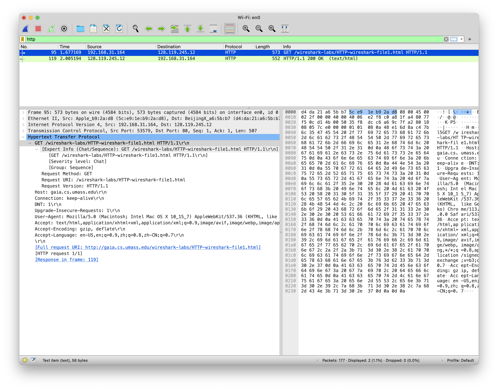
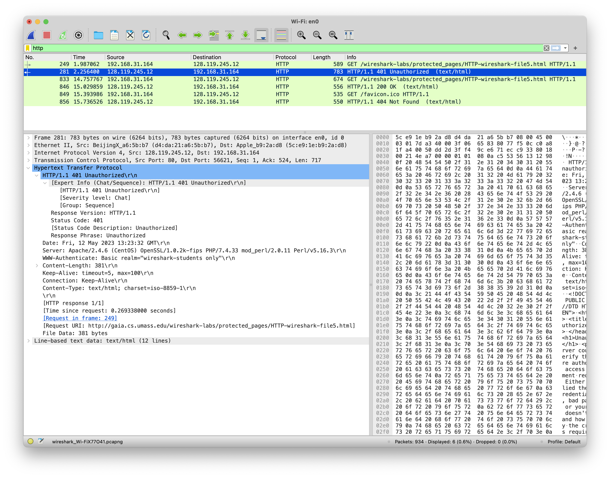

# Packet Trace Analysis

Yufan Zhang (NetID: yz605)

## The Basic HTTP GET/response interaction

The GET message:

The response message:

1. **Is your browser running HTTP version 1.0 or 1.1? What version of HTTP is the server running?**

- Both the browser and the server are running HTTP version 1.1.

2. **What languages (if any) does your browser indicate that it can accept to the server?**

> Accept-Language: en-US,en;q=0.9,zh;q=0.8,zh-CN;q=0.7

3. **What is the IP address of your computer? Of the gaia.cs.umass.edu server?**

- My computer: `192.168.31.164`
- Server: `128.119.245.12`

4. **What is the status code returned from the server to your browser?**

> HTTP/1.1 200 OK

5. **When was the HTML file that you are retrieving last modified at the server?**

> Last-Modified: Fri, 12 May 2023 05:59:01 GMT

6. **How many bytes of content are being returned to your browser?**

> Content-Length: 128

7. **By inspecting the raw data in the packet content window, do you see any headers within the data that are not displayed in the packet-listing window? If so, name one.**

- No.

## The HTTP CONDITIONAL GET/response interaction

The first GET message:

The response message:

The second GET message:

The response message:

8. **Inspect the contents of the first HTTP GET request from your browser to the server. Do you see an “IF-MODIFIED-SINCE” line in the HTTP GET?**

- No.

9. **Inspect the contents of the server response. Did the server explicitly return the contents of the file? How can you tell?**

- Yes. The server returned the contents of the file because the status code is `200 OK`. The line-based text data of the response can also be seen in the window.

    

1.  **Now inspect the contents of the second HTTP GET request from your browser to the server. Do you see an “IF-MODIFIED-SINCE:” line in the HTTP GET? If so, what information follows the “IF-MODIFIED-SINCE:” header?**

- Yes. The information following the header is `Fri, 12 May 2023 05:59:01 GMT`.

11. **What is the HTTP status code and phrase returned from the server in response to this second HTTP GET? Did the server explicitly return the contents of the file? Explain.**

- The status code is `304 Not Modified`. The server did not explicitly return the contents of the file since the local cache is up to date. The server only returned the header information.

## Retrieving Long Documents

The GET message:

The response message:

12. **How many HTTP GET request messages did your browser send? Which packet number in the trace contains the GET message for the Bill or Rights?**

- 1. The packet number is 42.

13. **Which packet number in the trace contains the status code and phrase associated with the response to the HTTP GET request?**

- The packet number is 59.

14. **What is the status code and phrase in the response?**

- The status code is `200 OK`.

15. **How many data-containing TCP segments were needed to carry the single HTTP response and the text of the Bill of Rights?**

- There are 5 data-containing TCP segments, which are `#55, #56, #57, #58, #59`.

## HTML Documents with Embedded Objects

The first GET message:

16. **How many HTTP GET request messages did your browser send? To which Internet addresses were these GET requests sent?**

- There are 4 GET request messages. The addresses are `128.119.245.12`, `128.119.245.12`, `178.79.137.164`, and `128.119.245.12` respectively.

17. **Can you tell whether your browser downloaded the two images serially, or whether they were downloaded from the two web sites in parallel? Explain.**

- The two images were downloaded in parallel. The response of the first image was received after the second GET request was sent.

## HTTP Authentication

The first GET message:

The first response message:

18. **What is the server’s response (status code and phrase) in response to the initial HTTP GET message from your browser?**

- The status code is `401 Unauthorized`.

19. **When your browser’s sends the HTTP GET message for the second time, what new field is included in the HTTP GET message?**

- The `Authorization` field is included.