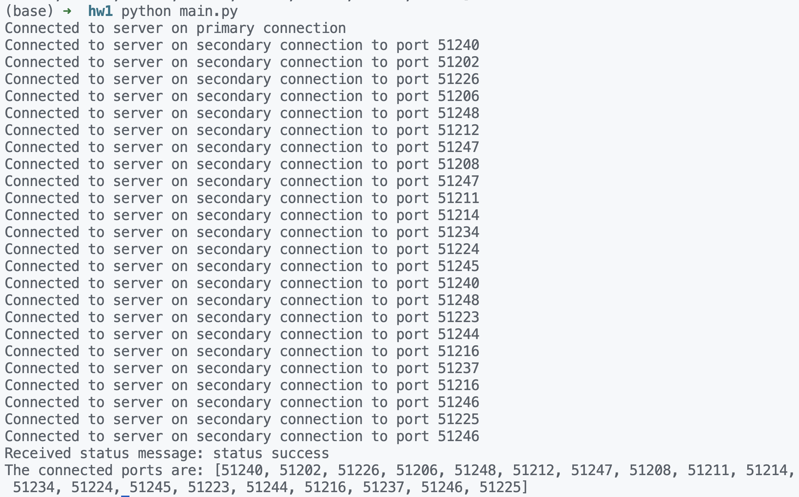

# NetMaze - Level 1

CompSci 311 (SP23), Duke Kunshan University

[Yufan Zhang](http://yufanbruce.com) (NetID: yz605)

---

This program is a multi-connection client that connects to a server and uses two types of connections: primary and secondary. The program runs on Python 3.7 or higher and uses asyncio for asynchronous I/O operations.

## Requirements

- Python 3.7 or higher
- asyncio

## Installation

Install the required dependencies using pip:

```
pip install asyncio
```

## Usage

1. Run the program from the command line:

    ```
    python3 main.py
    ```

2. The program connects to the server and sends an ID message with your ID to the server.
3. The server responds with a port number that the program uses for the primary connection.
4. The program establishes a secondary connection to the server on the given port.
5. The program sends an ID message to the server on the secondary connection.
6. The server responds with a new port number that the program uses for the next secondary connection.
7. Steps 4-6 are repeated until the server stops sending new port numbers.
8. The program receives status messages from the server and prints them to the console.

## Output

The output after running the program should be something like the below.




## Contact

[yufan.zhang@duke.edu](mailto:yufan.zhang@duke.edu)

[github.com/iamyufan](https://www.github.com/iamyufan)